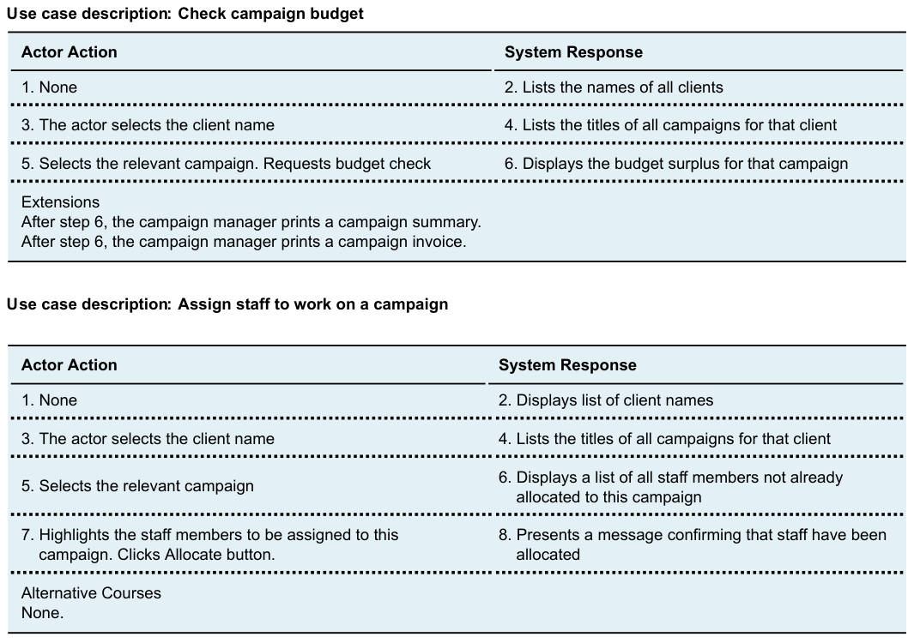

# Use Case Descriptions

## 📌 예시 Use Case: 회원 가입

- **Actor**: 회원
- **Trigger**: 회원이 가입 화면에서 정보를 입력하고 제출
- **Preconditions**: 사용자는 계정이 없어야 함
- **Main Flow**:
    1. 회원이 가입 페이지에 접속한다.
    2. ID, 비밀번호, 전화번호, 결제 수단, 선호 자전거 유형을 입력한다.
    3. 가입 버튼을 누른다.
    4. 시스템이 정보를 저장한다.
    5. 가입 성공 메시지를 출력한다.
- **Alternate Flow**:
    - ID 중복 시, 중복 알림을 띄우고 재입력을 유도한다.

| Assign staff to work on a campaign |  |
| --- | --- |
| Actor Action | System Response |
| 1. The actor enters the client name. | 2. Lists all campaigns for that
client. |
| 3. Selects the relevant campaign. | 4. Displays a list of all staff
members not already allocated
to this campaign. |
| 5. Highlights the staff members to be assigned to this campaign. | 6. Presents a message confirming
that staff have been allocated. |
| Alternative Courses |  |
| Steps 1–3. The actor knows the campaign name and enters it directly. |  |

## 회원 탈퇴 기능

---

## 로그인/로그아웃 기능

---

## 대여소 등록/조회/삭제 기능

---

## 자전거 등록/조회/삭제 기능

---

## 대여소 검색 기능

---

## 상세정보 조회 및 자전거 즉시대여/예약대기 기능

---

## 자전거 대여 정보 조회

---

## 자전거 예약대기 정보 조회/취소

---

## 자전거 반납 및 식당 예약 서비스 연계 기능

---